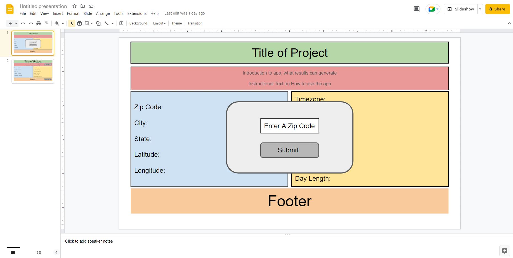

# Sunset Calculator

## Description

We built this webpage in order to create a quick and easy way for a user to access what time the sun will be setting in their area. We realized that most people guess at what time the sun will be setting and this webpage will solve tat issue. All it takes is entering a zip code and a user will get location information and the specific time they can catch a sunset.

## Table of Contents (Optional)

If your README is long, add a table of contents to make it easy for users to find what they need.

- [Installation](#installation)
- [Usage](#usage)
- [Credits](#credits)
- [License](#license)
- [Technologies](#technologies)
## Installation

What are the steps required to install your project? Provide a step-by-step description of how to get the development environment running.

## Usage

How it works:

Step 1: 
We begin by setting up our modal to accept an input value for any valid zip code in the united states.  Enter a zip code and press the "Submit" button.

Step 2: 
That input value is entered into a function that adds it to the url query to generate JSON returned data. 

Step 3: 
Next the latitude and longitude values retrieved from the Zippopotam.us API are stored into variables. These are then used to provide query parameters for the Sunrise Sunset API.

## Credits

Caleb Davidson
https://github.com/calebgdavidson

James Kelly
https://github.com/jk377y

Matthew Wessman
https://github.com/JimblesMw

Sam O'Cain
https://github.com/samocain93

Geneveve Perez
https://github.com/genrp24

The Coding Train https://www.youtube.com/watch?v=uxf0--uiX0I For technical assistance and walkthrough of working with data and APIs in JavaScript

Web Dev Tutorials https://www.youtube.com/watch?v=uUCpopjPZdI For technical assistance and walkthrough of modal building.

Web Dev Simplified https://www.youtube.com/watch?v=NIq3qLaHCIs For technical assistance and walkthrough of object deconstruction.
## License

The last section of a high-quality README file is the license. This lets other developers know what they can and cannot do with your project. If you need help choosing a license, refer to [https://choosealicense.com/](https://choosealicense.com/).

## Technologies
1). Bulma CSS styling Framework
    https://bulma.io/documentation/layout/tiles/
    https://www.youtube.com/watch?v=LBzZLzu2GKo
    

2). Sunset and Sunrise Times API
    https://sunrisesunset.io/api/

3). Zippopotam.us Zip Code Galore! API
    https://api.zippopotam.us/

4). Google Slides - used to preplan our project
    
    

🏆 The previous sections are the bare minimum, and your project will ultimately determine the content of this document. You might also want to consider adding the following sections.

## Badges

Badges aren't necessary, per se, but they demonstrate street cred. Badges let other developers know that you know what you're doing. Check out the badges hosted by [shields.io](https://shields.io/). You may not understand what they all represent now, but you will in time.

## Features

If your project has a lot of features, list them here.

## How to Contribute

If you created an application or package and would like other developers to contribute it, you can include guidelines for how to do so. The [Contributor Covenant](https://www.contributor-covenant.org/) is an industry standard, but you can always write your own if you'd prefer.

## Tests

Go the extra mile and write tests for your application. Then provide examples on how to run them here.