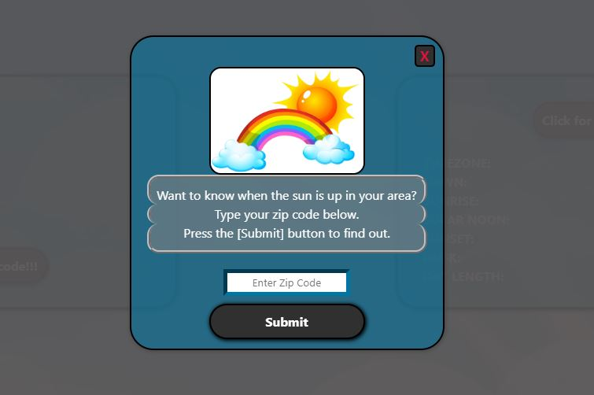
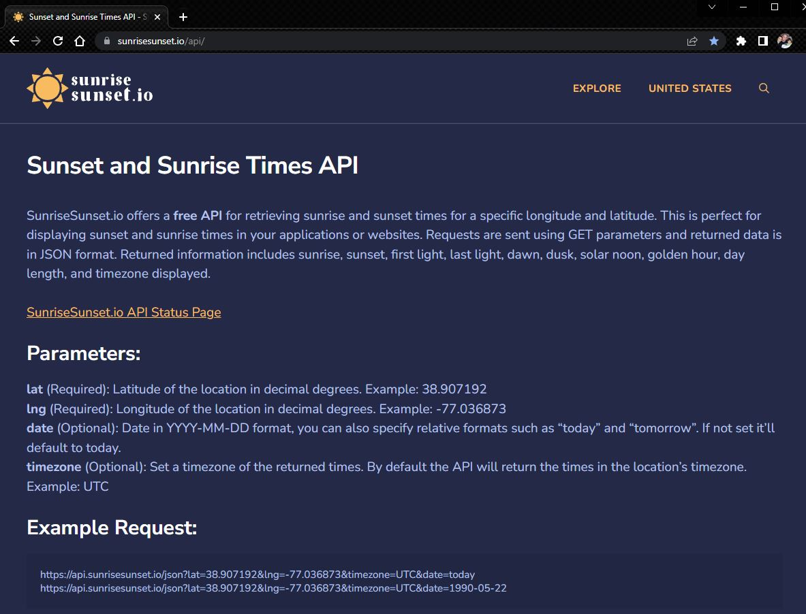

# Two API's, One Sun

## Description

We built this webpage in order to create a quick and easy way for a user to access what time the sun will be rising and setting in their area. We realized that most people guess at what time the sun will be setting and this webpage will help to solve that issue. All it takes is entering a zip code and a user will get location information, as well as specific sun events for their given location.

## Table of Contents

- [Description](#desciption)
- [Usage](#usage)
- [Credits](#credits)
- [Technologies](#technologies)

## Installation

The application can be viewed and tested at URL: https://calebgdavidson.github.io/Group-Project1/

## Usage

How it works:

Step 1: 
We begin by setting up our modal to accept an input value for any valid zip code in the United States.  Enter a zip code, and press the "Submit" button.

Step 2: 
That input value is entered into a function that adds it to the url query to generate JSON returned data. 

Step 3: 
Next the latitude and longitude values retrieved from the Zippopotam.us API are stored into variables. These are then used to provide query parameters for the Sunrise Sunset API.

## Credits

Caleb Davidson
https://github.com/calebgdavidson

James Kelly
https://github.com/jk377y

Matthew Wessman
https://github.com/JimblesMw

Sam O'Cain
https://github.com/samocain93

Geneveve Perez
https://github.com/genrp24

The Coding Train https://www.youtube.com/watch?v=uxf0--uiX0I For technical assistance and walkthrough of working with data and APIs in JavaScript

Web Dev Tutorials https://www.youtube.com/watch?v=uUCpopjPZdI For technical assistance and walkthrough of modal building.

Web Dev Simplified https://www.youtube.com/watch?v=NIq3qLaHCIs For technical assistance and walkthrough of object deconstruction.

## Technologies
1). Bulma CSS styling Framework
    https://bulma.io/documentation/layout/tiles/
    https://www.youtube.com/watch?v=LBzZLzu2GKo
    

2). Sunset and Sunrise Times API
    https://sunrisesunset.io/api/

3). Zippopotam.us Zip Code Galore! API
    https://api.zippopotam.us/

4). Google Slides - used to preplan our project
    
    
